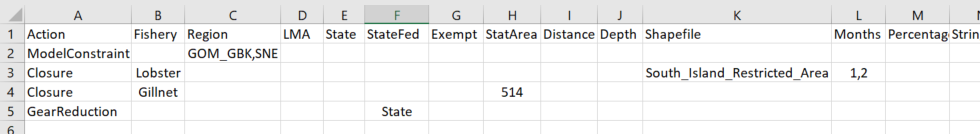

--- 
title: "Northwest Atlantic Protected Species Decision Support Tool User Manual"
author: "version 4.2.00"
date: "`r Sys.Date()`"
site: bookdown::bookdown_site
---

# Preparing the DST Model Run

## Example Base Run Code

To understand the setup of a DST model run, it's important to look at the basic code used to source the model code (including the version), set directories, and required model inputs. Model inputs are defined as a list object `InputList` with the required objects listed below. Finally, the model function `DecisionTool` is run.
```
rm(list=ls()) ## clear the global environment
HD="//net/work4/LobsterGroup/Management/RightWhales/DecisionSupportTool"; setwd(HD) ## set directory to where inputs will be read from 
Version="DST_V4.2.00.R" ## specify which DST version to load/run
source(paste0(HD, "/function_", Version)) ## load DST version/functions into R environment

## REQUIRED InputList INPUTS
InputList = list(
  HomeDir=HD, ## home directory for subdirectories
  ModelVersion=Version, ## model version
  InputActions=list(Name = "ScenarioName/Example.csv",
                    Source=”Wide”), ## see Section 1.2 Below
  MapRefDomain="MapRef_3.9.2.Rdata", ## MapRef version
  GearMapName = "FisheryInputs_AllEastCoast_v4.0.1.Rdata", ## fishery input layer
  ThreatModel="ThreatMod_RW_Selectivity_Uncertainty.Rdata", ## gear threat model
  WhaleHabitatModel="Duke_RightWhaleModel_v12_1019.Rdata", ## whale habitat model
WhaleVertDistInput=list(File="RightWhaleVerticalDistribution_CSA_V1.1.Rdata", Distribution="Ensemble"), ## whale vertical distribution
  WhaleDimensions="WhaleDimensions_AdHoc.Rdata", ## whale body dimensions
  CommentText = “Example Comment Text” ## comment text written to output tables
) 

DecisionTool(DecisionToolInputs = InputList) ## call DST function
```

## InputActions Structures 
Within `InputList`, `InputActions` defines the scenario or management actions to be tested. These user has the option to define these in either a saved spreadsheet .csv file or within the R code (explained in Section 1.2). For this example we have named our scenario "ScenarioName."

### Saved .csv File

When defining InputActions in the .csv file structure, an Excel spreadsheet (Ex. ScenarioTemplate_V4.0.0.xlsx) is used as a starting template for management. For each line, an action is specified and can be defined by fishery, spatial, and temporal bounds. Each additional column that subsets the action can be viewed as an "or" statement while each additional line (new action) can be viewed as an "and" statement. Commas can be used when specifying multiple entries for an individual cell. In this example InputActions spreadsheet there are four management actions. The first action restricts the model run to Gulf of Maine and Georges Bank (GOM_GBK) and Southern New England (SNE). The second action implements a closure to the lobster fishery in the South Island Restricted Area for January and February. The third action implements a year round closure to the gillnet fishery in Statistical Reporting Area 514. And the fourth action applies a gear reduction to state waters.



This Excel spreadsheet should be saved with a new name for the scenario run with the .csv file extension in the InputSpreadsheets directory (Ex. DecisionSupportTool/InputSpreadsheets/ScenarioName/Example.csv). “Source” tells the DST what format the input is in so it can read in the scenario inputs properly.
```
InputActions = list(Name = “ScenarioName/Example.csv”,
	Source = “Wide”)
```
### Create List of Actions

As an alternative to creating a saved .csv file in the InputSpreadsheets folder for model InputActions, the user can write individual actions as lists within the R code itself. These lists are then joined into a larger list of complete actions, then merge together as list of lists to write into InputActions. Following the example from the Excel spreadsheet above, we can apply these same actions as an input list in R before running the model code. In this case each action (A1, A2, A3, A4) equates to a row in the spreadsheet.
```
A1 <- list(Action = "ModelConstraint", 
           Region = "GOM_GBK,SNE")
A2 <- list(Action = "Closure", 
           Fishery = "Lobster",
           Months = "1,2",
           Shapefile = "South_Island_Restricted_Area")
A3 <- list(Action = "Closure",
           Fishery = "Gillnet",
           StatArea = "514")
A4 <- list(Action = "GearReduction",
           StateFed = "State")
My.Input.List <- list(A1,A2,A3,A4)
```
Since the DST will not be reading in an existing .csv file, the user will need to supply a directory name that will be associated with these input scenario actions (ScenarioName). For this method, “Source” is now the name of the list of lists you’ve just created.
```
InputActions = list(Name = “ScenarioName/Example”,
	Source = My.Input.List)
```
Be sure not to put “.csv” file at end of “Example”. This will lead the model to look for a .csv file within the “InputSpreadsheets/ScenarioName” rather than read your list. 

### Rerun or Modify Previous Scenario

At the beginning of each DST model run, the model inputs and scenario `InputActions` are written into an .RData file within the ScenarioName with an extension "_DecisionToolInputs". To rerun or modify a model, this .RData file can be read back into the R environment. 
```
load(paste0(HD,"/Scenarios/ScenarioName/Example/Example_DecisionToolInputs.Rdata"))
```
To rerun the model as-is, a new `InputList` is not required and the DST function can be called as follows:
```
DecisionTool(DecisionToolInputs)
```
The user can also modify the inputs of this model and rerun by redefining elements within the. For example, to modify rerun the above example changing the fishery input layer that is used within the model from GearMapName = "FisheryInputs_AllEastCoast_v4.0.1.Rdata" to GearMapName = "FisheryInputs_Gillnet_v3.5.5.Rdata" the user would apply the following code:
```
DecisionToolInputs$GearMapName <- "FisheryInputs_Gillnet_v3.5.5.Rdata"
DecisionTool(DecisionToolInputs)
```
## Optional InputList Inputs

The example base run code provided in Section 1.1 lists the mandatory inputs required in the `InputList`. Additional optional inputs are detailed in the table below.

| Variable Name | Example Text or T/F | Default Input | Notes |
|---|:---:|:---:|---|
| ZoneAdjacencyFile = | “ExampleCSV.csv” | “ZoneAdjacency_DSTv3.9.1.csv” | File for describing where gear can be displaced to during closure scenarios |
| TestScenario =  | TRUE or FALSE | TRUE | Run Scenario Inputs. If FALSE, only default/baseline inputs produced and scenario is NOT evaluated |
| CoOccurrence =  | TRUE or FALSE | FALSE | Run ONLY Co-Occurrence Model. Risk/Threat will not be estimated or produced |
| IncludeGroundGear =  | TRUE or FALSE | FALSE | Option to estimate Co-Occurrence and Risk associated with GroundGear (groundline and gillnets). If FALSE, only threat of vertical endlines is assessed |
| HighResolution =  | TRUE or FALSE | FALSE | If TRUE, scenario is run at 1nm^2 resolution. If FALSE, run is conducted at 10nm^2 resolution |
| RelocationCostExp =  | Positive Numeric Value | 1 | Cost of relocating gear during a closure scenario.  RelocationCost=Distance^(RelocationCostExp).  Higher values cause more 'fencing'; lower values spread gear more evenly outside of closures |
| ExpressRedistribution =  | TRUE or FALSE | FALSE |  |
| RopeStrengthResolution =  | Positive Numeric Value | 500 | Resolution that input rope strengths are rounded to. Lower values will lead to higher rope strength resolution, but will extend run time |
| MinGearDensity =  | Positive Numeric Value | 1e-5 | Threshold minimum gear density within a cell. Fishery input observations with less than this threshold will be removed from further modelling.  |
| AutoConstrain =  | TRUE or FALSE | FALSE | Option for DST to to automatically constrain spatial domain of scenario run to which area or fishery is specified in scenario actions |
| ThreatBounds =  | TRUE or FALSE | FALSE | Option to produce upper and lower 95% confidence intervals from Threat Model on estimated Risk estimates |
| CalculateAffectedLineDepth =  | TRUE or FALSE | FALSE |     |
| SpLayout =  |  | NA |  |
| PrintTables =  | TRUE or FALSE | TRUE | Option to print pdf of output tables- written to scenario subfolder specified in “InputActions = list()” |
| PrintDefaultMaps = | TRUE or FALSE | TRUE | Option to print pdf of output default maps and map sources (RData files)- written to scenario subfolder specified in “InputActions = list()” |
| PrintScenarioMaps =  | TRUE or FALSE | TRUE | Option to print pdf of output scenario maps and map sources (RData files)- written to scenario subfolder specified in “InputActions = list()” |
| PrintRedistributionMaps =  | TRUE or FALSE | FALSE | Option to print output redistribution maps of gear redistributed from closures- written to scenario subfolder specified in “InputActions = list()” |
| TruncateMaps =  | Positive Value between 0 and 1 | 1 | Upper quantile to truncate output maps at. Default value of “1” prints all output |
| WriteOutputCSV =  | TRUE or FALSE | TRUE | Write default and scenario results output to csv- written to scenario subfolder specified in “InputActions = list()” |
| WriteMapSources =  | TRUE or FALSE | FALSE | Option to print map sources (Rdata outputs) without printing pdf of output maps- written to scenario subfolder specified in “InputActions = list()” |
| ProvideSplitOutput =  | TRUE or FALSE | FALSE | Option for DST to report Co-Occurrence and Risk from vertical lines and = GroundGear separately |
| WriteDetailedOutput =  | TRUE or FALSE | FALSE | Option to write DST outputs from Stage 1 - 9 of the model as Rdata sources- written to scenario subfolder specified in “InputActions = list()” |
| PrintSummary =  | TRUE or FALSE | FALSE | Option to write out model summary to R Console at end of DST run |
| ArchiveInputSpreadsheet =  | TRUE or FALSE | FALSE | Remove scenario CSV from “InputActions = list()” scenario subfolder to an archive subfolder  |
| AggregateStrings =  | TRUE or FALSE | FALSE | Option to aggregate String distributions within vessel classes to decrease run time |
| ManageMemory =  | TRUE or FALSE | FALSE | Option to remove stage by stage output as the model progresses to reduce memory usage of scenario run |
| NewPlots =  | TRUE or FALSE | TRUE | Option to produce original mapping structure (FALSE) or updated mapping structure (TRUE) |
| PlotLMAs =  | TRUE or FALSE | FALSE | NOT YET FUNCTIONAL. Option to print outlines of Lobster Management Areas to output maps. |
|  PlotStatAreas =  | TRUE or FALSE | FALSE | NOT YET FUNCTIONAL. Option to print outlines of Statistical Reporting Areas to output maps. |
| SelectBaselineYears =  | Single value between 2012 and 2020 | NA | NOT YET FUNCTIONAL. Option to subset fishery layer to a single year that is used as baseline fishery layer for default and scenario Co-Occurrence and Risk calculations. |

### Available Fisheries

### Available Scenario Actions
